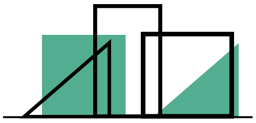

# Project Name

<h1 style="color:#53ad90;font-size:40px">
Maqar Platform 
</h1>

is a multitenant platform designed for the management of workspace reservations. It aims to streamline the process of booking and managing workspaces for their owners, providing a comprehensive solution for workspace owners looking to rent out their offices, meeting rooms, or event spaces to potential clients and lessees.

create by :Fatima Bakar Bakran 

## Getting Started

1. Make sure you have PHP and Composer installed on your machine.

2. Download the Maqar Platform project from its GitHub repository to your local machine.

3. Open your favorite text editor and navigate to the project folder.

4. Install all the required dependencies using Composer by running the following command:
   <code>composer install</code>
5. Create an .env file by duplicating the .env.example file provided in the project. Make sure to set your database information in this file.

6. Run the following command to generate a secret key for your Laravel application: php artisan key:generate

7. Run the following command to execute the migrations and create the database structure: php artisan migrate

8. Run the following command to start the built-in Laravel development server: php artisan serve

    9.email: fatimabakar707@gmail.com password:123456

The MySQL database file (script.sql) can be found at the path database/script.sql.

## Screenshots

### Landing Page and Login Page

  

  

### Client pages:

  

  

  

### Office Owner pages:

  

  

  

### Admin pages:

  

  

